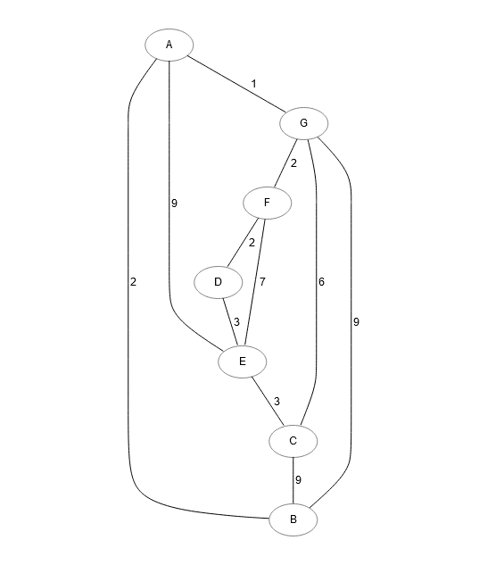
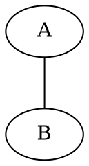

# UniViz Graphviz

Interactive graph building and step-by-step algorithm visualization for
[UniViz](https://univiz.org/).

[Open the live application](https://graph.univiz.org/) ·
[Production deployment](#production-deployment) ·
[Container package](https://github.com/orgs/SSW-JKU/packages/container/package/univiz-graphviz)

UniViz Graphviz helps students explore graph algorithms and gives lecturers a
visual teaching aid. Build a graph interactively or write DOT directly, then
follow Breadth-First Search, Depth-First Search, or Dijkstra's algorithm one
step at a time.



## What you can do

- Build directed and undirected graphs without writing DOT.
- Add and remove nodes, connect nodes, rename labels, and edit edge weights.
- Import, edit, validate, render, and copy Graphviz DOT source.
- Open the same graph in BFS, DFS, or Dijkstra without recreating it.
- Choose an algorithm's start node and inspect each step in the graph and table.
- Move backward and forward through a simulation or jump with the step slider.
- Start from one of four included example graphs and edit it further.
- Use optional PET guidance during Dijkstra demonstrations, including
  highlights, explanations, questions, and immediate answer feedback.

## Application tour

| Area | Purpose |
| --- | --- |
| Graph Builder | Create directed or undirected graphs interactively and edit node labels or edge weights. |
| DOT Visualizer | Edit DOT in CodeMirror and see the Graphviz layout update alongside it. |
| Examples | Select a prepared graph, edit it, or send it directly to an algorithm. |
| BFS and DFS | Follow visited nodes, neighbors, traversal order, and queue state where applicable. |
| Dijkstra | Follow tentative distances, predecessor paths, visited nodes, and the current local minimum. |
| Teacher Mode | Step through the selected algorithm with synchronized graph highlighting and state tables. |

Graphs move between views through the URL-encoded `dotSrc` query parameter.
This makes a graph reproducible across the builder, visualizer, and algorithm
pages and allows a configured view to be shared as a URL.

## Run locally

Requirements:

- Node.js 22 (matching the production build image)
- npm

Install the locked dependencies and start Vite:

```bash
npm ci
npm run dev
```

Vite prints the local address, normally `http://localhost:5173/`.

Useful checks:

```bash
npm run check
npm run build
npm run preview
```

## Run with Docker

The public image is available from GitHub Container Registry and does not
require authentication:

```bash
docker pull ghcr.io/ssw-jku/univiz-graphviz:latest
docker run --rm -p 8080:80 ghcr.io/ssw-jku/univiz-graphviz:latest
```

Open `http://localhost:8080/`.

The production image builds the Vite application with Node.js and serves the
static bundle through nginx. The nginx configuration includes an
`index.html` fallback so application routes work when opened directly.

## Production deployment

The supported production setup uses Docker Compose:

- `graph-app` serves the application on `127.0.0.1:3003`.
- `watchtower` checks the `latest` image every 120 seconds and replaces the
  application container when a new image is published.
- Caddy can expose the local port through HTTPS.

On the production server, download the repository's
[Compose file](deploy/docker-compose.yml) and start the complete stack:

```bash
sudo mkdir -p /opt/graph-app
cd /opt/graph-app

sudo curl -fsSL -o docker-compose.yml \
  https://raw.githubusercontent.com/SSW-JKU/univiz-graphviz/HEAD/deploy/docker-compose.yml

sudo docker compose pull
sudo docker compose up -d --remove-orphans
sudo docker compose ps
```

The `HEAD` segment resolves to the repository's current default branch. To
deploy an updated Compose file or image later, rerun:

```bash
cd /opt/graph-app
sudo curl -fsSL -o docker-compose.yml \
  https://raw.githubusercontent.com/SSW-JKU/univiz-graphviz/HEAD/deploy/docker-compose.yml
sudo docker compose pull
sudo docker compose up -d --remove-orphans
sudo docker compose ps
```

For HTTPS, use [deploy/Caddyfile.example](deploy/Caddyfile.example) as the
reverse-proxy configuration.

Pushes to `master` publish these image tags:

```text
ghcr.io/ssw-jku/univiz-graphviz:latest
ghcr.io/ssw-jku/univiz-graphviz:<commit-sha>
```

## Routes

| Route | View |
| --- | --- |
| `/` | Product overview and available modes |
| `/graphbuilding/build-undirected-graph` | Undirected graph builder |
| `/graphbuilding/build-directed-graph` | Directed graph builder |
| `/graphbuilding/visualizer` | DOT editor and visualizer |
| `/graphbuilding/examples` | Prepared graph examples |
| `/algorithms/bfs` | Breadth-First Search |
| `/algorithms/dfs` | Depth-First Search |
| `/algorithms/dijkstra` | Dijkstra's shortest-path algorithm |
| `/about` | Project and thesis background |

## How it works

### Graph representation

The application keeps two identifiers for each node:

- `id` is the application-facing identifier, such as `node0`.
- `d3id` is the numeric identifier used by D3, Graphviz-derived layouts, and
  algorithm steps.

Edges reference their endpoint nodes and can carry a weight plus layout
coordinates parsed from Graphviz output.

### Algorithm simulation

Each algorithm produces an ordered collection of `AlgorithmStep` objects. A
step records the current node and edge, visited nodes and edges, descriptive
text, and algorithm-specific state such as neighbors, queues, distances,
predecessors, and shortest paths.

`src/algorithms/Base.svelte` coordinates the shared simulation interface:

- Graph and edge highlighting
- State-table updates
- Start-node selection
- Previous, next, and slider navigation
- Teacher Mode state
- PET question gating and feedback

### DOT and Graphviz

The application accepts Graphviz DOT and uses Viz.js to calculate layouts.
Undirected input is normalized internally where the common renderer and
algorithm code require directed edges.



### PET guidance

PET annotations attach educational guidance to algorithm steps without
changing the algorithm result. Supported actions include:

- `highlight` for graph or table targets
- `say` for explanatory callouts
- `ask` for gated questions with answer feedback

Graph annotations are rendered by `SVGPetAnnotationManager`; table highlighting
is computed by `TablePetAnnotationManager`. Annotation IDs must remain unique
because they key answer, feedback, and callout state.

## Project structure

```text
univiz-graphviz/
  src/
    algorithms/       Algorithm implementations and shared simulation UI
    colors/           Shared color definitions
    components/       Graph builder, visualizer, tables, and PET rendering
    images/           Preview images for included graph examples
    pages/            Routed application pages
    prototypes/       Earlier D3 and Svelte experiments
    types/            Shared graph data types
  deploy/             Docker Compose and Caddy configuration
  Dockerfile          Multi-stage production image
  nginx.conf          Static server and SPA fallback
  package.json        Development and validation scripts
```

Key implementation files:

- `src/App.svelte` defines navigation and routes.
- `src/components/GraphBuilder.svelte` implements interactive graph creation.
- `src/components/Visualizer.svelte` implements DOT editing and rendering.
- `src/algorithms/Base.svelte` implements the shared simulation interface.
- `src/algorithms/BFS.ts`, `DFS.ts`, and `Dijkstra.ts` generate algorithm steps.
- `src/components/DijkstraTable.svelte` renders the Dijkstra state table.
- `src/components/PetAnnotations.ts` renders and tracks PET guidance.

## Technology

- Svelte and TypeScript
- Vite
- D3 and d3-graphviz
- Graphviz through Viz.js
- CodeMirror
- nginx
- Docker Compose and Watchtower

## Background

The application originated as a bachelor's thesis project at Johannes Kepler
University Linz for the course *Algorithms and Data Structures 2*. Its goal is
to supplement slides and blackboard explanations with an interactive,
experiment-friendly representation of graph structures and algorithms.
