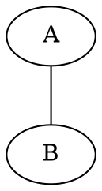
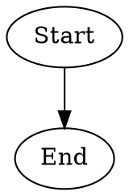

# Univiz Graphviz

This project is the Graphviz-based graph algorithm visualization part of
univiz.org. It provides a browser-based environment for building graphs,
importing DOT source, and stepping through BFS, DFS, and Dijkstra with
synchronized graph and table views.

The application is built with Svelte, TypeScript, Vite, D3, Graphviz/Viz.js, and
CodeMirror.

## Features

- Build directed and undirected graphs interactively.
- Import, edit, and visualize DOT graph descriptions.
- Copy generated DOT source from the graph builder.
- Open graphs directly in algorithm views through URL-encoded DOT source.
- Step through BFS, DFS, and Dijkstra simulations.
- Show algorithm state in a synchronized table view.
- Highlight visited, seen, selected, and irrelevant graph elements.
- Use PET guidance in teacher mode for Dijkstra:
  - graph and table highlights
  - speech bubbles
  - gated multiple-choice questions
  - answer feedback
  - draggable SVG callouts

## Project Structure

```text
univiz-graphviz/
  src/
    algorithms/       Algorithm implementations and shared simulation UI
    colors/           CSS color constants
    components/       Graph builder, visualizer, tables, PET renderers
    images/           Example graph preview images
    pages/            Routed page components
    prototypes/       Earlier D3/Svelte experiments
    types/            Shared graph data types
  LaTeX/              Thesis sources and generated thesis artifacts
  deploy/             VM deployment examples for Docker Compose and Caddy
  Dockerfile          Production image build
  nginx.conf          Static nginx runtime config with SPA fallback
  package.json        Development, build, preview, and check scripts
```

Important application files:

- `src/App.svelte` defines the routes and navigation.
- `src/components/GraphBuilder.svelte` implements interactive graph creation.
- `src/components/Visualizer.svelte` implements DOT editing and rendering.
- `src/algorithms/Base.svelte` contains the shared algorithm simulation UI.
- `src/algorithms/BFS.ts`, `DFS.ts`, and `Dijkstra.ts` generate simulation
  steps.
- `src/components/DijkstraTable.svelte` renders the algorithm table.
- `src/components/PetAnnotations.ts` contains `SVGPetAnnotationManager` and
  `TablePetAnnotationManager`.

## Getting Started

Install dependencies from this directory:

```bash
npm install
```

Start the development server:

```bash
npm run dev
```

Vite prints the local URL in the terminal, usually `http://localhost:5173/`.

Build the production bundle:

```bash
npm run build
```

Preview the production build locally:

```bash
npm run preview
```

Run Svelte and TypeScript diagnostics:

```bash
npm run check
```

## Docker Deployment

The production image builds the Vite app with Node and serves the generated
`dist` directory with nginx. The nginx config falls back to `index.html`, so
client-side routes work when opened directly.

Build the image locally:

```bash
docker build -t ghcr.io/guck1311/univiz-graphviz:latest .
```

Run it locally:

```bash
docker run --rm -p 8080:80 ghcr.io/guck1311/univiz-graphviz:latest
```

### Publishing

GitHub Actions builds and publishes the image on pushes to `main` or `master`:

```text
ghcr.io/guck1311/univiz-graphviz:latest
ghcr.io/guck1311/univiz-graphviz:<commit-sha>
```

The package can be public. If it is private, log in on the VM before pulling:

```bash
echo "<github-token>" | docker login ghcr.io -u Guck1311 --password-stdin
```

The token needs `read:packages` for pulling a private image.

### Hetzner VM

Install Docker and the Compose plugin:

```bash
apt update
apt install docker.io docker-compose-v2
systemctl enable --now docker
```

Create the deployment directory and fetch the compose file:

```bash
mkdir -p /opt/graph-app
cd /opt/graph-app
curl -fsSL -o docker-compose.yml https://raw.githubusercontent.com/Guck1311/univiz-graphviz/master/deploy/docker-compose.yml
```

Start or update the app:

```bash
docker compose pull
docker compose up -d --remove-orphans
```

Reusable update command:

```bash
cd /opt/graph-app && docker compose pull && docker compose up -d --remove-orphans
```

The compose file binds the container to `127.0.0.1:3003`, so it is only exposed
locally on the VM. Watchtower is included and checks every 120 seconds for a new
image tagged `latest`; when it finds one, it recreates the app container and
removes the old image.

### Caddy

Use Caddy as the public HTTPS reverse proxy:

```caddy
graph.univiz.org, graphs.univiz.org {
  reverse_proxy 127.0.0.1:3003
}
```

Reload Caddy after changing the Caddyfile:

```bash
systemctl reload caddy
```

## Application Routes

- `/` - project overview and goals
- `/graphbuilding/build-undirected-graph` - interactive undirected graph builder
- `/graphbuilding/build-directed-graph` - interactive directed graph builder
- `/graphbuilding/visualizer` - DOT editor and graph visualizer
- `/graphbuilding/examples` - predefined graph examples
- `/algorithms/bfs` - Breadth-First Search simulation
- `/algorithms/dfs` - Depth-First Search simulation
- `/algorithms/dijkstra` - Dijkstra simulation
- `/about` - thesis background and feature overview

Graph state is passed between views with a `dotSrc` query parameter. For
example, the builder and visualizer link into algorithm routes by URL-encoding
the current DOT source.

## Graph Model

The app uses two node identifiers:

- `id`: application-facing identifier such as `node0`
- `d3id`: numeric identifier used by D3, Graphviz-derived layouts, and algorithm
  steps

Edges store references to their endpoint nodes, optional weights, and layout
positions parsed from Graphviz/Viz.js output.

## Algorithm Simulation

Each algorithm returns an ordered list of `AlgorithmStep` objects. A step records
the current node, current edge, visited nodes, visited edges, descriptive text,
and optional algorithm-specific state such as queues, neighbors, distances,
previous nodes, seen nodes, and PET annotations.

`Base.svelte` consumes these steps and coordinates:

- graph highlighting
- table updates
- step navigation
- teacher mode state
- PET question gating

## PET Annotations

PET annotations are optional metadata attached to algorithm steps. They describe
pedagogical guidance without changing the algorithm result.

Supported annotation actions:

- `highlight`: emphasizes graph or table targets
- `say`: renders an explanatory speech bubble
- `ask`: renders a question bubble with answer options and feedback

Supported targets include:

- whole graph
- node
- edge
- Dijkstra distance column
- Dijkstra local-min column

Rendering is split by surface:

- `SVGPetAnnotationManager` renders SVG graph highlights, speech bubbles, and
  question callouts.
- `TablePetAnnotationManager` computes table highlight state for table targets.

PET annotation IDs must be unique because they key answer state, feedback state,
dragged callout offsets, and duplicate-recording checks.

## DOT and Graphviz Notes

The application accepts DOT input and uses Viz.js for graph layout. Undirected
graphs are internally normalized to directed DOT where needed so the shared
renderer and algorithm code can operate consistently.

Example undirected graph:



Example directed graph:


